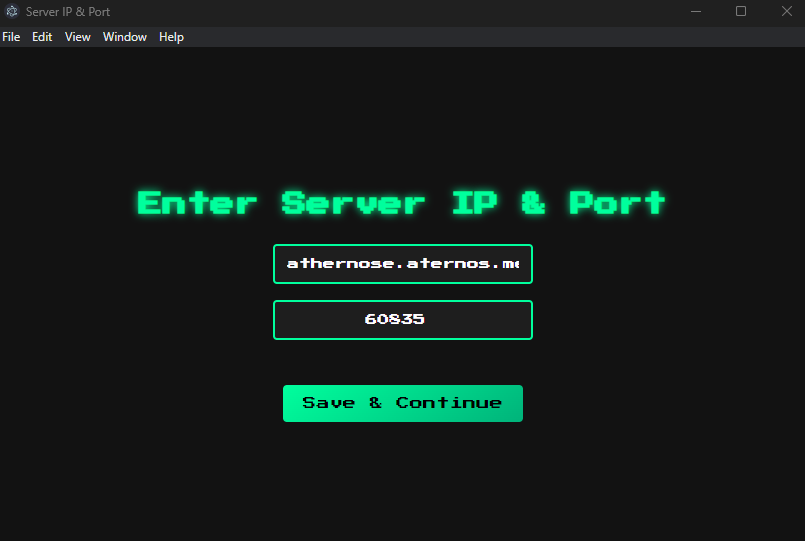
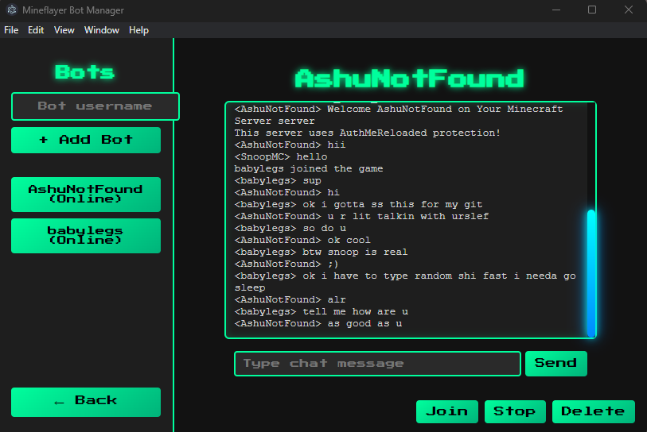

**BotManagerGUI** is a desktop application made with **Electron** and **Mineflayer**.  
It lets you manage multiple Minecraft bots easily.  
You can send messages, automate tasks, and control bots from a simple and clean graphical interface.

## Setup
1. Clone the repository:
   git clone https://github.com/YourUsername/BotManagerGUI.git
2. Install dependencies:
   npm install
3. Run the app:
   npm start
